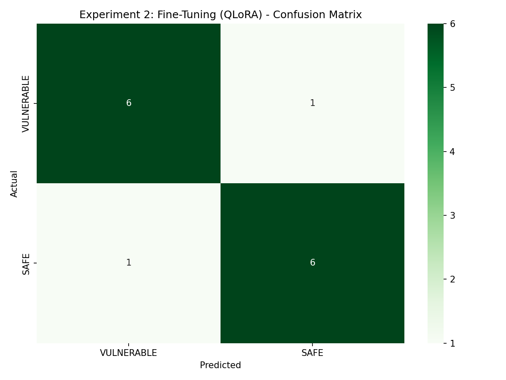

# Experiment 2: Fine-Tuning with QLoRA

## Solana Smart Contract Vulnerability Detection using LLMs

[](https://python.org)
[](https://pytorch.org)
[](https://huggingface.co)
[](LICENSE)

---

## 📋 Overview

This experiment fine-tunes **LLaMA-3.1-8B-Instruct** using **QLoRA** (Quantized Low-Rank Adaptation) for binary vulnerability classification in Solana smart contracts.

### Key Innovation
Using `DataCollatorForCompletionOnlyLM` to compute loss **only on the classification output**, preventing the model from memorizing prompts and enabling true generalization.

---

## 🎯 Results Summary

| Metric | Value |
|--------|-------|
| **Overall Accuracy** | 71.43% |
| **Precision** | 80.00% |
| **Recall** | 57.14% |
| **F1-Score** | 66.67% |

### Per-Vulnerability Performance

| Vulnerability Type | Accuracy | Precision | Recall | F1-Score |
|-------------------|----------|-----------|--------|----------|
| Bump Seed | 100% | 1.00 | 1.00 | 1.00 |
| Missing Key Check | 100% | 1.00 | 1.00 | 1.00 |
| Type Confusion | 100% | 1.00 | 1.00 | 1.00 |
| Unchecked Calls | 100% | 1.00 | 1.00 | 1.00 |
| DoS | 50% | 0.00 | 0.00 | 0.00 |
| Integer Flow | 50% | 0.00 | 0.00 | 0.00 |
| CPI | 0% | 0.00 | 0.00 | 0.00 |

### Confusion Matrix

```
                 Predicted
              VULN    SAFE
Actual VULN    4       3     (TP=4, FN=3)
       SAFE    1       6     (FP=1, TN=6)
```



---

## 🔧 Method

### QLoRA Configuration

```python
LoraConfig(
    r=64,                    # Rank
    lora_alpha=16,           # Scaling factor
    lora_dropout=0.1,        # Regularization
    target_modules=[         # Fine-tuned layers
        "q_proj", "k_proj", "v_proj", "o_proj",  # Attention
        "gate_proj", "up_proj", "down_proj"       # MLP
    ]
)
```

### Training Configuration

| Parameter | Value |
|-----------|-------|
| Epochs | 3 |
| Learning Rate | 2e-4 |
| Batch Size | 2 |
| Gradient Accumulation | 4 |
| Effective Batch Size | 8 |
| Max Sequence Length | 1024 |
| Optimizer | paged_adamw_32bit |
| Warmup Ratio | 0.03 |

### Why DataCollatorForCompletionOnlyLM?

**Problem:** Standard training computes loss on entire text (prompt + response), causing memorization.

**Solution:** Compute loss **only after** `<|start_header_id|>assistant<|end_header_id|>`:

```
❌ Standard: Loss("System...User...Code...VULNERABLE")  → Memorization
✅ Completion-Only: Loss("VULNERABLE")                  → Learning
```

---

## 📊 Dataset

| Split | Samples | Percentage |
|-------|---------|------------|
| Training | 112 | 80% |
| Validation | 14 | 10% |
| Test | 14 | 10% |
| **Total** | **140** | 100% |

**Vulnerability Types:** 7 categories (Bump Seed, CPI, DoS, Integer Flow, Missing Key Check, Type Confusion, Unchecked Calls)

---

## 🚀 Quick Start

### Prerequisites

```bash
pip install torch transformers peft==0.9.0 trl==0.12.0 bitsandbytes accelerate
```

### Training

```python
from trl import SFTTrainer, SFTConfig, DataCollatorForCompletionOnlyLM

# Response template for completion-only training
RESPONSE_TEMPLATE = "<|start_header_id|>assistant<|end_header_id|>"
data_collator = DataCollatorForCompletionOnlyLM(
    response_template=RESPONSE_TEMPLATE,
    tokenizer=tokenizer
)

trainer = SFTTrainer(
    model=model,
    args=training_config,
    train_dataset=train_dataset,
    peft_config=lora_config,
    data_collator=data_collator,
    tokenizer=tokenizer,
)

trainer.train()
```

### Inference

```python
def predict(code):
    prompt = f"""<|begin_of_text|><|start_header_id|>system<|end_header_id|>
You are a smart contract security analyzer.
Classify the code as VULNERABLE or SAFE.<|eot_id|><|start_header_id|>user<|end_header_id|>
{code}<|eot_id|><|start_header_id|>assistant<|end_header_id|>
"""
    inputs = tokenizer(prompt, return_tensors="pt").to(model.device)
    outputs = model.generate(**inputs, max_new_tokens=10, do_sample=False)
    response = tokenizer.decode(outputs[0][inputs['input_ids'].shape[1]:])
    return "VULNERABLE" if "VULN" in response.upper() else "SAFE"
```

---

## 📁 Output Files

| File | Description |
|------|-------------|
| `solana-vuln-model/` | Fine-tuned LoRA adapter weights |
| `results_fine_tuning.csv` | Detailed predictions |
| `summary_fine_tuning.json` | Experiment configuration & metrics |
| `cm_fine_tuning.png` | Confusion matrix visualization |

---

## 🔬 Analysis

### Strengths
- **Perfect detection** for 4/7 vulnerability types
- **High precision (80%)**: Low false positive rate
- Fine-tuning improves over zero-shot baseline

### Weaknesses
- **Low recall (57%)**: Misses some vulnerabilities
- **CPI detection fails**: Model confused between classes
- **Small test set**: Only 2 samples per vulnerability type

### Recommendations
1. Increase dataset size for underperforming categories
2. Use class-weighted loss for imbalanced detection
3. Experiment with higher LoRA rank for complex patterns

---

## 📚 References

1. Dettmers et al. (2023). *QLoRA: Efficient Finetuning of Quantized LLMs*. [arXiv:2305.14314](https://arxiv.org/abs/2305.14314)
2. Hu et al. (2021). *LoRA: Low-Rank Adaptation of Large Language Models*. [arXiv:2106.09685](https://arxiv.org/abs/2106.09685)

---

## 📄 License

This project is part of IEEE BCCA 2025 research on LLM-based vulnerability detection in Solana smart contracts.

---

## 🔗 Related Experiments

- **Experiment 1:** Zero-Shot Prompt Engineering
- **Experiment 3:** Hybrid Approach (Fine-Tuned + RAG)
- **Experiment 4:** Few-Shot Prompting
