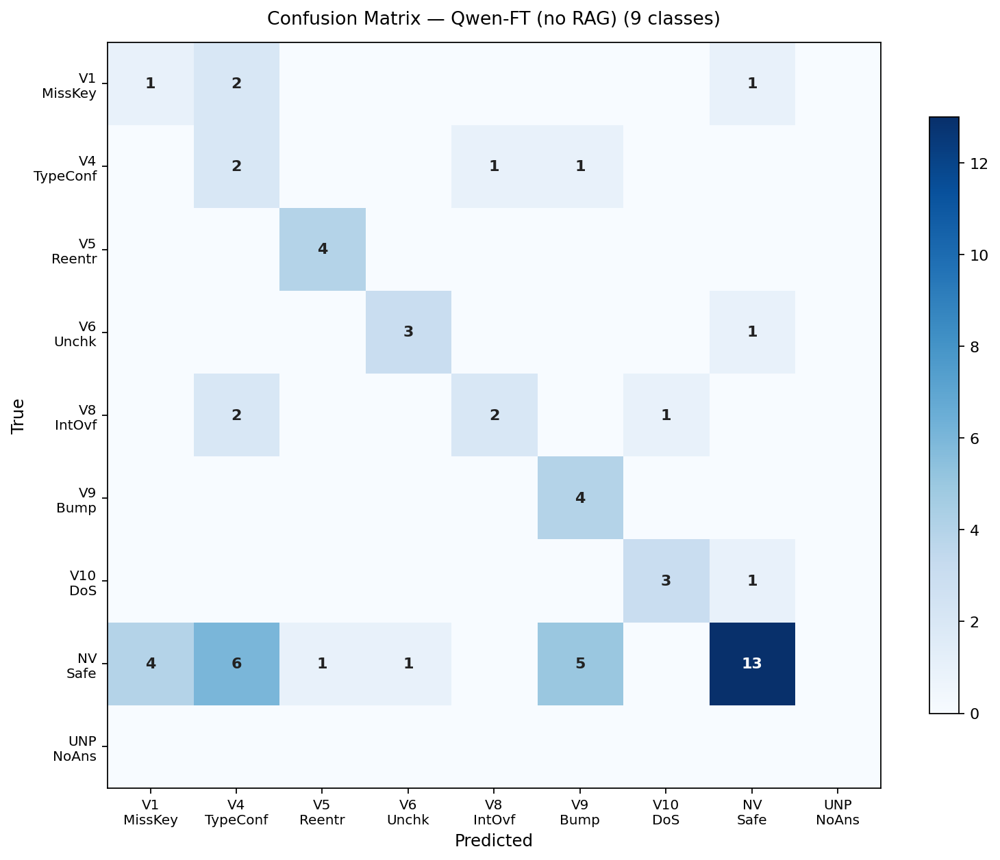
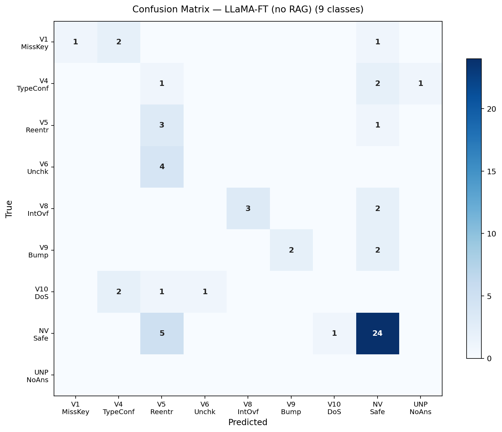
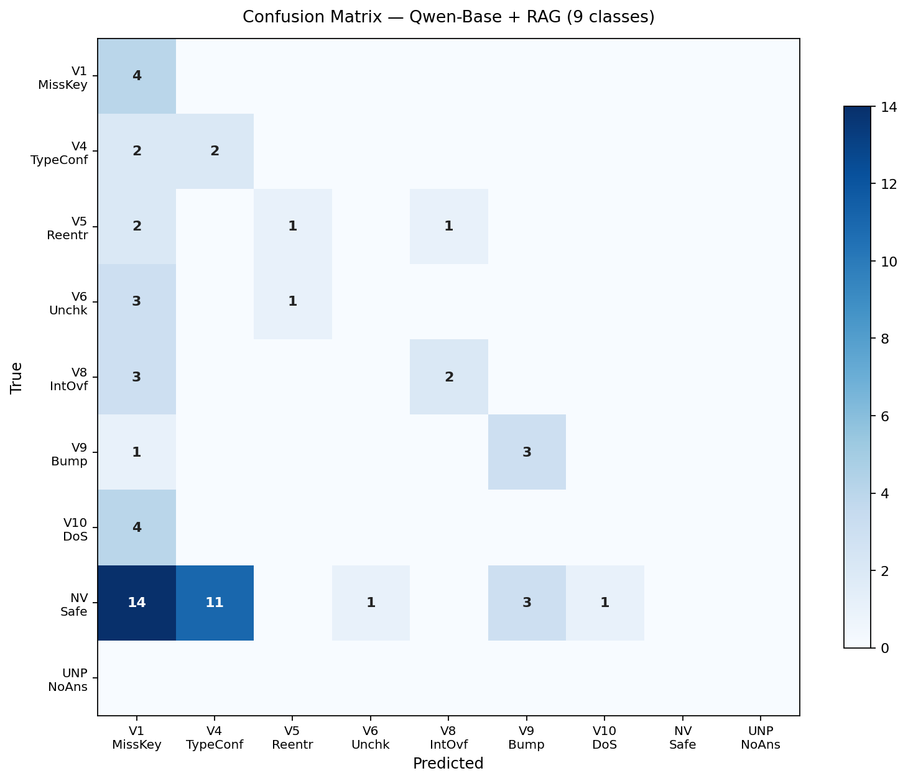
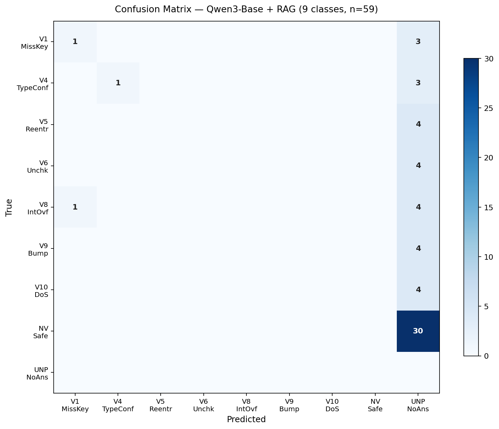

# Confusion Matrix and Binary Classification Analysis

**Author:** Mustafa Abuzaraiba
**Supervisors:** Prof. Christian Esposito, Dr. Biagio Boi
**Date:** May 2026
**Thesis:** LLM-based vulnerability detection in Solana smart contracts

---

## 1. Context

Following the supervisors' request during the last meeting, two additional analyses were performed on the existing experimental data:

1. **Confusion Matrix** (9 × 9) for all 12 experiments — 3 models × 4 configurations.
2. **Binary re-evaluation** (VULNERABLE vs NOT_VULNERABLE) to test the hypothesis that *"the model detects vulnerabilities but confuses the specific class."*

No new inference was executed. All analyses were derived from the per-sample predictions already logged in the evaluation notebooks.

---

## 2. Methodology

**Collapse rule (multi-label → single-label).** The original parser returns a *list* of vulnerability names per contract (sometimes empty, sometimes containing multiple terms). For the confusion matrix, each list was reduced to a single label as follows:

| Predicted list contains... | Final label |
|---|---|
| At least one specific vulnerability | First canonical vulnerability (vulnerability wins over "Not Vulnerable") |
| Only "Not Vulnerable" terms | Not Vulnerable |
| Empty (parser failed) | **Unparseable** (9th class) |

Synonym normalization was applied (e.g. `Reentrancy` → `CPI Reentrancy`, `DoS` → `Denial of Service`).

**Binary mapping.** Truth and prediction were collapsed to two classes; `Unparseable` predictions were counted as `NOT_VULNERABLE` (the model made no vulnerability claim).

**Dataset-key fix.** During processing, two raw truth keys were found unmapped in the original `VULN_DISPLAY` table: `integer_flow` and `cpi`. These were normalized to `Integer Overflow` and `CPI Reentrancy`, respectively — a correction also relevant for the existing multi-class metrics.

---

## 3. Unified Results — 12 Experiments

| Model | Configuration | Multi-class F1 | **Binary F1** | Δ F1 | Bin. Precision | Bin. Recall |
|---|---|---|---|---|---|---|
| LLaMA-3.1-8B | Base (no RAG) | 0.0833 | 0.3415 | +0.26 | 0.5833 | 0.2414 |
| LLaMA-3.1-8B | Base + RAG | 0.0915 | 0.5217 | +0.43 | 0.5714 | 0.4828 |
| LLaMA-3.1-8B | **FT (no RAG)** | 0.1429 | **0.7273** ⭐ | +0.58 | 0.7692 | 0.6897 |
| LLaMA-3.1-8B | FT + RAG | 0.1573 | 0.6774 | +0.52 | 0.6364 | 0.7241 |
| Qwen2.5-Coder-32B | Base (no RAG) | 0.2909 | 0.4615 | +0.17 | 0.5217 | 0.4138 |
| Qwen2.5-Coder-32B | Base + RAG | 0.3358 | 0.6591 | +0.32 | 0.4915 | **1.0000** |
| Qwen2.5-Coder-32B | **FT (no RAG)** | **0.5135** ⭐ | 0.7222 | +0.21 | 0.6047 | 0.8966 |
| Qwen2.5-Coder-32B | FT + RAG | 0.2720 | 0.6667 | +0.39 | 0.5581 | 0.8276 |
| Qwen3-32B | Base (no RAG) | 0.2373 | 0.5614 | +0.32 | 0.5714 | 0.5517 |
| Qwen3-32B | Base + RAG | 0.1667 | 0.1875 | +0.02 | 1.0000 | 0.1034 |
| Qwen3-32B | FT (no RAG) | 0.2909 | 0.6538 | +0.36 | 0.7391 | 0.5862 |
| Qwen3-32B | FT + RAG ⚠ | 0.2785 | 0.5806 | +0.30 | 0.5000 | 0.6923 |

⚠ *Qwen3-FT + RAG: 54/59 samples — five contracts (#19, 20, 37, 38, 57) failed during the original run and were not logged.*

**Mean Δ F1 across all 12 experiments: +0.32.**
This confirms the supervisors' hypothesis: the binary task is substantially easier than the multi-class one for every model and configuration tested.

---

## 4. Key Confusion-Matrix Findings

### 4.1 Best overall performer: Qwen2.5-Coder-32B FT (no RAG)

A clean diagonal emerges across most classes: V5 (4/4), V9 (4/4), V10 (3/4), V6 (3/4). The Unparseable column is zero — fine-tuning eliminated format failures entirely. Residual weakness lies in benign-class precision: 16 of 30 benign contracts are flagged as some vulnerability (most often V4 or V9), explaining the binary precision of 0.60 against recall of 0.90.

### 4.2 Systematic class confusion: LLaMA-FT no-RAG, V6 → V5

A clear systematic error: every V6 contract (Unchecked External Calls) is classified as V5 (CPI Reentrancy). The model appears to associate any external call pattern with reentrancy by default. This explains a large fraction of the multi-class error budget that the binary view hides.

### 4.3 The "paranoid RAG" effect: Qwen2.5-Base + RAG

Without fine-tuning, RAG on Qwen2.5 collapses into a degenerate predictor: **every benign contract (30/30) is flagged as some vulnerability**, and the model never produces a "Not Vulnerable" verdict. Binary recall is therefore a perfect 1.0, but precision is 0.49 — essentially random. The retrieved checklist appears to bias the model toward over-warning when no fine-tuning grounds the decision.

### 4.4 The opposite failure mode: Qwen3-Base + RAG

Under nominally identical conditions, RAG on Qwen3 produces the **opposite degenerate behaviour**: 56 of 59 contracts are classified as "Not Vulnerable", including 26 of 29 truly-vulnerable ones. Binary precision is 1.0 (no false alarms) but recall collapses to 0.10. The two cases together (4.3 and 4.4) suggest that RAG without fine-tuning is highly unstable and model-specific — it can amplify either over- or under-confidence depending on how the base model integrates retrieved context.

---

## 5. What the Hypothesis Test Tells Us

The professors hypothesized that *low multi-class scores might reflect class confusion rather than detection failure*. The binary re-evaluation confirms this hypothesis with two caveats:

| Observation | Evidence |
|---|---|
| **Hypothesis holds for fine-tuned models.** | All four FT configurations gain between +0.21 and +0.58 F1 when collapsed to binary. The models *do* detect vulnerabilities reliably; they confuse the specific class. |
| **Hypothesis breaks for some RAG-base combinations.** | Qwen3-Base + RAG gains only +0.02 — its low score is *not* class confusion, but genuine failure to detect anything. Qwen2.5-Base + RAG gains +0.32, but only because it predicts vulnerability everywhere. |

**Best operating point across all experiments: FT (no RAG)** for every model. RAG combined with a non-fine-tuned base destabilizes prediction; RAG combined with fine-tuning consistently *reduces* performance relative to FT alone.

---

## 6. Limitations

1. **Sample size.** 59 test contracts yield 4–5 samples per vulnerability class. Confusion-matrix patterns are indicative, not statistically conclusive.
2. **Partial run.** Qwen3-FT + RAG completed only 54 of 59 samples. Five contracts (#19, 20, 37, 38, 57) failed during the original notebook execution, likely due to OOM or timeout.
3. **Unmapped truth keys.** Two raw vulnerability keys (`integer_flow`, `cpi`) were absent from the original notebook's display map, meaning the previously reported multi-class metrics under-counted matches for those classes. The corrected analysis presented here uses the fixed mapping.
4. **Collapse rule sensitivity.** When the parser returned multiple vulnerabilities, the "first non-NV class wins" rule was applied. Alternative rules (e.g. random choice, majority vote among normalized synonyms) could shift individual cell counts but would not change the aggregate conclusions.

---

## 7. Conclusion

The two analyses requested by the supervisors are complete for all 12 experiments. The principal findings are:

- **The supervisors' hypothesis is confirmed for fine-tuned models** but not universally: weak base + RAG combinations can fail at detection itself, not just at classification.
- **Fine-tuning without RAG is the most reliable configuration** across every model in the study.
- **RAG without fine-tuning is highly unstable**, producing opposite failure modes (over- and under-warning) on near-identical model families.
- **Qwen2.5-Coder-32B FT** achieves the best multi-class result (F1 = 0.51); **LLaMA-3.1-8B FT** marginally leads on binary detection (F1 = 0.73). The two models are effectively tied as binary detectors but Qwen2.5 is substantially stronger at class identification.

All 12 confusion matrices, the unified comparison table, and the per-experiment binary statistics are included with this report as supporting files.
